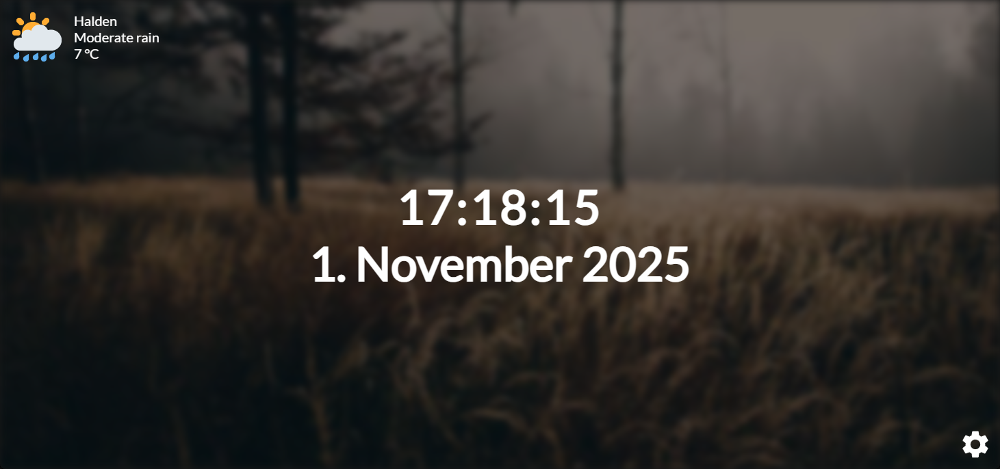

A web browser extension that allows you to customize your new tab/homepage with themes, weather and more. I made this many years ago when I was still learning web development, since many people still loved it back in the days when it was first released.

Goal is to make it as lightweight as possible, meaning no unnecessary bloat or dependency. Just a simple and clean homepage, made to be using most of the vanilla web technologies.

> [!NOTE]
> If you want to test it out before downloading it, you can visit https://alexflipnote.dev/homepage which is the demo page. Some of the functions are available to test, but not all of them for obvious reasons.

## Platforms
- [Chrome](https://chromewebstore.google.com/detail/alexflipnotehomepage/npagigfpfilcemncemkphndcaigegcbk) (or literally any* Chromium-based browser)
- [Firefox](https://addons.mozilla.org/addon/alexflipnote-homepage/)

> [!WARNING]
> There are some Chromium browsers that do not fully support it.<br>
> Known incompatible browsers so far: Opera, OperaGX, Brave, Vivaldi.

## Preview


## Development
In order to set up the development environment, you need to have [NodeJS](https://nodejs.org/) installed on your machine. After that, you can clone the repository and install the dependencies using npm or yarn.
```bash
git clone https://github.com/AlexFlipnote/homepage
cd homepage
npm install
```

To build the project, you can use the following command:
```bash
npm run build
```

This command will create two folders for you, `dist` and `out`.
- `dist` contains the extension files packed in zip format
- `out` contains the unpacked extension files that you can load into your browser for testing.

You can also run only some parts of the build process in case you just wish to quickly build for example the SASS or compile the JS files:
```bash
npm run build:css
npm run build:js
```

## Credits
| Resource | Link |
| -------- | ---- |
| CSS filter generator | https://angel-rs.github.io/css-color-filter-generator/ |
| Google Font Icons | https://fonts.google.com/icons |
| Leaflet | https://leafletjs.com/ |
| OpenStreetMap | https://www.openstreetmap.org/ |
